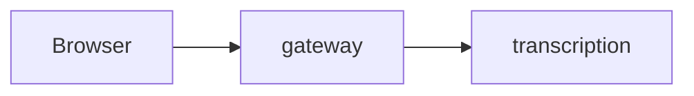

<!-- Review guide for the owner in German first (AGENTS.md, "Pull requests"), technical details in English below. -->

> **Merge-Gefahr:** Risiko **niedrig / mittel / hoch** · **revertibel / nicht revertibel** (warum) · Wirkradius: **örtlich / dienstübergreifend / System** · Nutzen: **hoch / mittel / niedrig** (warum)
> **Empfohlene Review-Tiefe:** überfliegen · gezielt die genannten Stellen · Zeile für Zeile

<!-- Herleitung (AGENTS.md, "Pull requests"): nicht revertibel = Verträge/Schema, Migration oder
Datenverlust, Secrets/Security, CI/Branch-Schutz, nach außen sichtbares Verhalten.
Risiko niedrig = revertibel + örtlich; hoch = nicht revertibel oder Wirkradius System; sonst mittel.
Nutzen: hoch = Phasenziel/MVP oder spürbarer Fehler; mittel = Qualität/Prozess; niedrig = Aufräumen. -->

## Für Marco: Review-Leitfaden

**Was und warum** (höchstens drei Sätze, Plan-Task nennen, dazu eine Struktur-Skizze):

<!-- Struktur-Skizze im show-me-Stil statt Prosa: das kleinste Bild, das den Kern zeigt –
Pseudocode der Logik, Komponenten- oder Dateibaum (gern als ```diff), Aufrufkette.
Mermaid weiter nur, wenn sich ein Fluss oder die Architektur ändert. -->

**Hier genau hinschauen** (höchstens fünf Stellen, riskanteste zuerst):

- `pfad/datei.ts:10-40`: warum hier ein Fehler wehtun würde

**Kannst du überspringen:** Tests, Lockfile, Evidence, reine Formatierung, …

**Belegt durch** (jede Anforderung dieses PRs mit ihrem Test, wie die Tabelle „DoD → Tests“ im Plan):

| Anforderung | Stufe | Test |
|---|---|---|
| … | 1 / 2a / 2b / 3 / 4 | `pfad/test.ts` („Testname“) |

**Deine Entscheidungen:**

- [ ] …

**So habe ich geprüft:** Stufe 0 … · Stufe 1 … · Stufe 3/4 im isolierten Stack …

**Agent-Bilanz** (erzeugt mit `python3 scripts/agent-usage.py --since <Branch-Beginn>`):

<!-- Token je Modell, Top-Werkzeuge mit Fehlerquote, Wiederholungen. Dashboard mit Verlauf:
privates Artefakt „Agenten-Bilanz“, wird an jedem Gate von der Retro aktualisiert. -->

**Merge-Reihenfolge:** (nur bei gestapelten PRs)

<!-- Mermaid only when a flow or the architecture changes:

-->

---

## Details (English)

### Changes

### Deviations from the plan or brief

### Evidence

`docs/evidence/phase-N/…`
