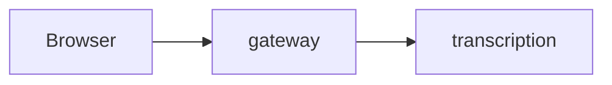

<!-- Review guide for the owner in German first (AGENTS.md, "Pull requests"), technical details in English below. -->

> **Merge-Gefahr:** Risiko **niedrig / mittel / hoch** · **revertibel / nicht revertibel** (warum) · Wirkradius: **örtlich / dienstübergreifend / System** · Nutzen: **hoch / mittel / niedrig** (warum)
> **Empfohlene Review-Tiefe:** überfliegen · gezielt die genannten Stellen · Zeile für Zeile

<!-- Herleitung (AGENTS.md, "Pull requests"): nicht revertibel = Verträge/Schema, Migration oder
Datenverlust, Secrets/Security, CI/Branch-Schutz, nach außen sichtbares Verhalten.
Risiko niedrig = revertibel + örtlich; hoch = nicht revertibel oder Wirkradius System; sonst mittel.
Nutzen: hoch = Phasenziel/MVP oder spürbarer Fehler; mittel = Qualität/Prozess; niedrig = Aufräumen. -->

## Für Marco: Review-Leitfaden

**Was und warum** (höchstens drei Sätze, Plan-Task nennen, dazu eine Struktur-Skizze):

<!-- Struktur-Skizze im show-me-Stil statt Prosa: das kleinste Bild, das den Kern zeigt –
Pseudocode der Logik, Komponenten- oder Dateibaum (gern als ```diff), Aufrufkette.
Mermaid weiter nur, wenn sich ein Fluss oder die Architektur ändert. -->

**Hier genau hinschauen** (höchstens fünf Stellen, riskanteste zuerst):

- `pfad/datei.ts:10-40`: warum hier ein Fehler wehtun würde

**Kannst du überspringen:** Tests, Lockfile, Evidence, reine Formatierung, …

**Deine Entscheidungen:**

- [ ] …

**Merge-Reihenfolge:** (nur bei gestapelten PRs)

<!-- Ab hier eingeklappt, damit der PR kompakt öffnet (AGENTS.md, owner 2026-09-30).
GitHub braucht die Leerzeile nach </summary>, sonst rendern Tabellen/Mermaid nicht. -->

<details><summary><b>Belegt durch</b> (jede Anforderung mit ihrem Test, wie „DoD → Tests“ im Plan)</summary>

| Anforderung | Stufe | Test |
|---|---|---|
| … | 1 / 2a / 2b / 3 / 4 | `pfad/test.ts` („Testname“) |

</details>

<details><summary><b>Bilder und Diagramme</b> (Bildschirmfotos, Schaubild, Mermaid)</summary>

</details>

<details><summary><b>So habe ich geprüft</b></summary>

Stufe 0 … · Stufe 1 … · Stufe 3/4 im isolierten Stack …

</details>

<details><summary><b>Agent-Bilanz</b> (`python3 scripts/agent-usage.py --since <Branch-Beginn>`)</summary>

<!-- Token je Modell, Top-Werkzeuge mit Fehlerquote, Wiederholungen; Dashboard-Link. -->

</details>

<!-- Mermaid only when a flow or the architecture changes:

-->

<details><summary><b>Details (English)</b></summary>

### Changes

### Deviations from the plan or brief

### Evidence

`docs/evidence/phase-N/…`

</details>
