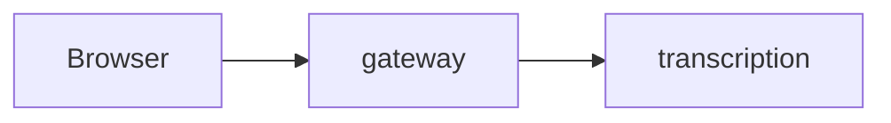

<!-- Review guide for the owner in German first (AGENTS.md, "Pull requests"), technical details in English below. -->

## Für Marco: Review-Leitfaden

**Was und warum** (höchstens drei Sätze, Plan-Task nennen):

**Hier genau hinschauen** (höchstens fünf Stellen, riskanteste zuerst):

- `pfad/datei.ts:10-40`: warum hier ein Fehler wehtun würde

**Kannst du überspringen:** Tests, Lockfile, Evidence, reine Formatierung, …

**Belegt durch** (jede Anforderung dieses PRs mit ihrem Test, wie die Tabelle „DoD → Tests“ im Plan):

| Anforderung | Stufe | Test |
|---|---|---|
| … | 1 / 2a / 2b / 3 / 4 | `pfad/test.ts` („Testname“) |

**Deine Entscheidungen:**

- [ ] …

**So habe ich geprüft:** Stufe 0 … · Stufe 1 … · Stufe 3/4 im isolierten Stack …

**Merge-Reihenfolge:** (nur bei gestapelten PRs)

<!-- Mermaid only when a flow or the architecture changes:

-->

---

## Details (English)

### Changes

### Deviations from the plan or brief

### Evidence

`docs/evidence/phase-N/…`
