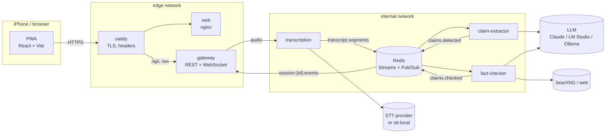

# live-factcheck

[](https://github.com/marcominervinidev/live-factcheck/actions/workflows/ci.yml)
[](https://github.com/marcominervinidev/live-factcheck/actions/workflows/codeql.yml)

A mobile-first web app that listens to a conversation, transcribes it live, detects checkable factual claims and rates them with web research and an LLM while the conversation is still going.

> Someone says *"World War II ended only 20 years ago."* A card appears: **❌ false**, confidence high, *"World War II ended in 1945, more than 80 years ago."*, plus the sources.

The product is the vehicle; the project is primarily a **DevOps and platform engineering portfolio**: containers from day one, event-driven services, twelve-factor configuration, security by design, a CI pipeline that grows with every phase, and later Kubernetes with GitOps.

## Status

| Phase | Scope | State |
|---|---|---|
| 0 – Foundation | monorepo, contracts, service skeletons, hardened images, Compose stack, CI, agent tooling | **in progress** (gate 5 of 7) |
| 1 – Text mode | LLM and search adapters, fact-checker, result cards, eval set | planned |
| 2 – Live transcription | audio capture, WebSocket path, STT adapters, claim extraction, iPhone over HTTPS | planned |
| 3 – Speakers and UX | diarization, speaker names, latency | planned |
| 4 – Persistence | Postgres, session history, retention | planned |
| 5 – Kubernetes and GitOps | k3d, Argo CD, KEDA, NetworkPolicies, observability | planned |
| 6 – Real cluster | Terraform, k3s on VMs, staging/prod, signed images, SBOM | planned |

The detailed plan of the current phase lives in [`.ai/plans/`](.ai/plans/); decisions are recorded as [ADRs](docs/adr/).

## Architecture



Every service is stateless and scales horizontally; workers share load through Redis consumer groups. External dependencies (LLM, speech-to-text, search) sit behind adapters and are chosen by configuration, including fully local models. Details: [docs/architecture.md](docs/architecture.md).

## What this project shows

- **Twelve-factor services in containers from the first commit.** One image per service is built once and configured only through environment variables and secret files. Config is validated at startup and fails fast.
- **Hardened images.** Multi-stage builds with distroless or nginx-unprivileged runtimes, numeric non-root users, root-owned read-only code and no shell ([ADR 0003](docs/adr/0003-container-images-and-hardening.md)).
- **Contract-first, event-driven design.** Strict, versioned zod schemas. A CI guard rejects contract changes that lack an ADR and a version bump ([ADR 0002](docs/adr/0002-event-contract-format.md)).
- **Enforced module boundaries.** dependency-cruiser runs in pre-commit and CI and blocks service-to-service imports, deep imports and cycles.
- **Secrets done properly.** Secrets never live in the repo, images or logs. Local secrets sit outside the working tree, services accept `<NAME>_FILE`, and logs are scrubbed of secret values. Tests prove all three.
- **A pipeline that grows per phase** ([ADR 0005](docs/adr/0005-ci-workflow-layout.md)):
  - fast push checks, with backend and frontend running in parallel on affected workspaces only
  - PR stages: image build, Trivy, Semgrep, CodeQL, hadolint and the contract check
  - Actions pinned by SHA, minimal permissions, one aggregate check per workflow for branch protection
- **Shift-left testing.** Static checks, unit tests and Testcontainers integration tests run today. API and E2E tests with Playwright, including a WebKit/iPhone profile, follow later in phase 0. Pre-commit takes about 5 s.
- **AI-assisted engineering with guardrails.** Claude Code and Antigravity work from the same rules, prompts and skills. Git hooks, CI and branch protection are the real guards, not the agent ([docs/ai-tooling.md](docs/ai-tooling.md), [ADR 0006](docs/adr/0006-agent-tooling-layout.md)).
- **Evidence over claims.** Every task leaves proof (command output, CI runs, screenshots) in [docs/evidence/](docs/evidence/).

## Repository layout

```
apps/web/            PWA frontend (React, Vite, Tailwind, Zustand; nginx in production)
services/            gateway, transcription, claim-extractor, fact-checker (Node.js, TypeScript)
packages/            contracts (zod schemas), service-kit (runtime), providers (adapters)
.github/workflows/   ci (push), pr, codeql
docs/                brief, ADRs, architecture, evidence, AI tooling
tools/toolbox/       dev container: the only place Node tooling runs
```

## Getting started

Host requirements: Docker, Git, VS Code. Node and Python are not installed on the host; everything runs in containers.

```sh
make toolbox install hooks-install   # dev container, dependencies, pre-commit hook
make secrets-init                    # ~/.config/live-factcheck/secrets: internal secrets generated,
                                     # external API keys empty (only needed for real providers)
make up                              # build and start the stack, wait until healthy
make ready                           # /readyz of every service + the app through Caddy
open https://localhost               # the app (Caddy's local CA; trust it once)
```

Everything runs with `mock` providers by default, so no API key is needed. Other targets: `make dev` (hot reload), `make test`, `make scan`, `make check-ports`, `make logs`, `make down`; `make help` lists them all. If macOS Apache already uses port 80, set `LFC_HTTP_PORT=8081` in `.env`.

## Recommended branch protection

`main` is protected by a ruleset: changes only via pull request, no force pushes or deletions, and the required checks `ci passed` and `pr passed` must be green. Merges happen only after a file-by-file review by the owner.

## License

Not yet decided; all rights reserved until a license is added.
