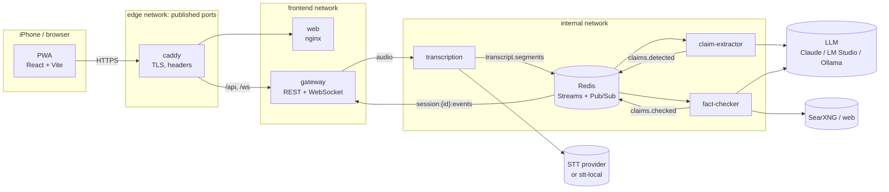

# live-factcheck

[](https://github.com/marcominervinidev/live-factcheck/actions/workflows/ci.yml)
[](https://github.com/marcominervinidev/live-factcheck/actions/workflows/codeql.yml)

A mobile-first web app that listens to a conversation, transcribes it live, detects checkable factual claims and rates them with web research and an LLM while the conversation is still going.

> Someone says *"World War II ended only 20 years ago."* A card appears: **❌ false**, confidence high, *"World War II ended in 1945, more than 80 years ago."*, plus the sources.

The product is the vehicle; the project is primarily a **DevOps and platform engineering portfolio**: containers from day one, event-driven services, twelve-factor configuration, security by design, a CI pipeline that grows with every phase, and later Kubernetes with GitOps.

## Status

| Phase | Scope | State |
|---|---|---|
| 0 – Foundation | monorepo, contracts, service skeletons, hardened images, Compose stack, CI, agent tooling | done |
| 1 – Text mode | LLM, classifier and search adapters, live research, fact-checker, explainer, result cards, eval set | **in review** (gate 8 of 8) |
| 1b – Security tooling | SonarQube Cloud, OWASP ZAP, LLM red teaming (promptfoo), local LLM code scan | planned |
| 2 – Live transcription | audio capture, WebSocket path, STT adapters, claim extraction, iPhone over HTTPS | planned |
| 3 – Speakers and UX | diarization, speaker names, latency | planned |
| 4 – Persistence | Postgres, session history, retention | planned |
| 5 – Kubernetes and GitOps | k3d, Argo CD, KEDA, NetworkPolicies, observability | planned |
| 6 – Real cluster | Terraform, k3s on VMs, staging/prod, signed images, SBOM | planned |

The detailed plan of the current phase lives in [`.ai/plans/`](.ai/plans/); decisions are recorded as [ADRs](docs/adr/).

## Architecture


```mermaid
flowchart LR
  subgraph client[iPhone / browser]
    web[PWA<br/>React + Vite]
  end
  subgraph edge[edge network: published ports]
    caddy[caddy<br/>TLS, headers]
  end
  subgraph frontend[frontend network]
    webc[web<br/>nginx]
    gw[gateway<br/>REST + WebSocket]
  end
  subgraph internal[internal network]
    tr[transcription]
    ce[claim-extractor]
    fc[fact-checker]
    redis[(Redis<br/>Streams + Pub/Sub)]
  end
  stt[(STT provider<br/>or stt-local)]
  llm[(LLM<br/>Claude / LM Studio / Ollama)]
  search[(SearXNG / web)]

  web -- HTTPS --> caddy
  caddy --> webc
  caddy -- /api, /ws --> gw
  gw -- audio --> tr
  tr --> stt
  tr -- transcript.segments --> redis
  redis --> ce
  ce --> llm
  ce -- claims.detected --> redis
  redis --> fc
  fc --> search
  fc --> llm
  fc -- claims.checked --> redis
  redis -- session:{id}:events --> gw
```

Every service is stateless and scales horizontally; workers share load through Redis consumer groups. External dependencies (LLM, speech-to-text, search) sit behind adapters and are chosen by configuration, including fully local models. Details: [docs/architecture.md](docs/architecture.md).

## What this project shows

- **Twelve-factor services in containers from the first commit.** One image per service is built once and configured only through environment variables and secret files. Config is validated at startup and fails fast.
- **Hardened images.** Multi-stage builds with distroless or nginx-unprivileged runtimes, numeric non-root users, root-owned read-only code and no shell ([ADR 0003](docs/adr/0003-container-images-and-hardening.md)).
- **Contract-first, event-driven design.** Strict, versioned zod schemas. A CI guard rejects contract changes that lack an ADR and a version bump ([ADR 0002](docs/adr/0002-event-contract-format.md)).
- **Enforced module boundaries.** dependency-cruiser runs in pre-commit and CI and blocks service-to-service imports, deep imports and cycles.
- **Secrets done properly.** Secrets never live in the repo, images or logs. Local secrets sit outside the working tree, services accept `<NAME>_FILE`, and logs are scrubbed of secret values. Tests prove all three.
- **A pipeline that grows per phase** ([ADR 0005](docs/adr/0005-ci-workflow-layout.md)):
  - fast push checks, with backend and frontend running in parallel on affected workspaces only
  - PR stages: image build, Trivy, Semgrep, CodeQL, hadolint and the contract check
  - Actions pinned by SHA, minimal permissions, one aggregate check per workflow for branch protection
- **Shift-left testing.** Every stage of the test pyramid exists and runs where it is cheapest (table below). Pre-commit stays around 10 s, the PR pipeline around 5 minutes.
- **AI-assisted engineering with guardrails.** Claude Code and Antigravity work from the same rules, prompts and skills. Git hooks, CI and branch protection are the real guards, not the agent ([docs/ai-tooling.md](docs/ai-tooling.md), [ADR 0006](docs/adr/0006-agent-tooling-layout.md)).
- **Evidence over claims.** Every task leaves proof (command output, CI runs, screenshots) in [docs/evidence/](docs/evidence/).

## Repository layout

```
apps/web/            PWA frontend (React, Vite, Tailwind, Zustand; nginx in production)
services/            gateway, transcription, claim-extractor, fact-checker (Node.js, TypeScript)
packages/            contracts (zod schemas), service-kit (runtime), providers (adapters)
tests/               api (stage 3) and e2e (stage 4) suites against the running stack
deploy/compose/      Caddy, Redis and SearXNG configuration for the local stack
.github/workflows/   ci (push), pr, main, nightly, codeql, stack-tests (reusable)
docs/                brief, ADRs, architecture, security, evidence, AI tooling
tools/toolbox/       dev container: the only place Node tooling runs
```

## Testing

| Stage | What | Where | When |
|---|---|---|---|
| 0 static | TypeScript strict, ESLint, Prettier, module boundaries, gitleaks | whole repo | pre-commit, every push |
| 1 unit | Vitest, Testing Library | next to the code (`*.test.ts`) | pre-commit (affected), every push |
| 2a integration (backend) | services against a real Redis (Testcontainers) | `*.int.test.ts` | every push |
| 2b integration (frontend) | the app in Chromium and WebKit/iPhone against a mocked backend, axe | `apps/web/tests/` | every push |
| 3 API | ops endpoints, TLS (verified against Caddy's CA), headers, routing, auth, text mode end to end (verdict before explanation) | `tests/api/` | every PR, after merge |
| 4 E2E | user journeys through Caddy in Chromium, WebKit/iPhone (Firefox nightly) | `tests/e2e/` | every PR (sharded), after merge |
| 5 quality | Lighthouse, mutation testing (Stryker), claim eval (accuracy, calibration, latency, cost) | `apps/web/lighthouserc.json`, `packages/{contracts,providers}`, `evals/` | nightly; eval on demand |

Coverage must stay at 80 % lines and branches in every workspace (enforced in CI). In CI every Playwright test records trace, video and screenshot; each PR gets a comment linking the reports.

`make test` runs stages 0–4 locally, everything in containers.

## Getting started

Host requirements: Docker, Git, VS Code. Node and Python are not installed on the host; everything runs in containers.

```sh
make toolbox install hooks-install   # dev container, dependencies, pre-commit hook
make secrets-init                    # ~/.config/live-factcheck/secrets: internal secrets generated,
                                     # external API keys empty (only needed for real providers)
make up                              # build and start the stack, wait until healthy
make ready                           # /readyz of every service + the app through Caddy
open https://localhost               # the app (Caddy's local CA; trust it once)
```

Everything runs with `mock` providers by default, so no API key is needed. Other targets: `make dev` (hot reload), `make test`, `make scan`, `make check-ports`, `make logs`, `make down`; `make help` lists them all. If another program already uses port 80 or 443 (e.g. macOS Apache), set `LFC_HTTP_PORT=8080` or `LFC_HTTPS_PORT` in `.env` (copy it from `.env.example`).

After pulling a new version, run `make secrets-init` again: it adds secret files that new services need and never overwrites existing ones.

### Trying text mode

1. `make up`, then open `https://localhost` (or your `LAN_HOST`).
2. Open **Einstellungen** and paste the access token from the file `gateway_token` in your secrets directory (`~/.config/live-factcheck/secrets/`). It is the key for this app's own API, not a Claude or other provider key; the browser keeps it locally.
3. Type a claim, e.g. *"Der Zweite Weltkrieg ist erst 20 Jahre vorbei."*, and press **Prüfen**. The card shows the verdict with its confidence first and the explanation a moment later; tap it for the sources.

With the default `mock` providers the verdicts come from a small fixed corpus, which is enough to try the flow. For real checks, configure real providers.

### Trying live mode

1. Set the token as in text mode, then press **Aufnahme starten**.
2. The consent dialog names every active cloud provider (speech-to-text, classifier, LLM). Record only if everyone present agrees; without the provider list there is no recording.
3. Talk. The transcript appears live (grey while a sentence is still forming, black once final); a checkable claim is underlined, first as *wird geprüft*, then in the colour of its verdict. Tap it to jump to its card.
4. **Aufnahme beenden** stops it. Locking the screen, switching apps or losing the connection also ends the recording and says why.

With `mock` providers the speech-to-text ignores what you say and reads a fixed German script (every 2 s of audio one sentence, the second one a false claim). For real transcription, set a speech-to-text provider below. Audio is never stored; transcripts live in Redis for at most 15 minutes (ADR 0018). On the iPhone the microphone needs HTTPS, see [Trusting the local certificate](#trusting-the-local-certificate); the manual iPhone check is [docs/testing/iphone-smoke.md](docs/testing/iphone-smoke.md).

### Real providers

Providers are chosen per task in `.env` (see `.env.example`); keys go only into the secret files.

| Provider | Settings | Key file |
|---|---|---|
| Claude | `CHECKER_LLM_PROVIDER=anthropic`, `CHECKER_LLM_MODEL=claude-opus-5`; explainer and extractor likewise (e.g. `claude-haiku-4-5`) | `anthropic_api_key` |
| LM Studio / Ollama on the Mac | `CHECKER_LLM_PROVIDER=openai-compatible`, `CHECKER_LLM_BASE_URL=http://host.docker.internal:1234/v1` (Ollama: port `11434`) | none |
| Classifier | `CHECKER_CLASSIFIER_PROVIDER=llm` (uses the checker's LLM) or `typesafe` with `CHECKER_CLASSIFIER_MODEL=jev-1.13.0` | `typesafe_api_key` |
| Speech-to-text | `STT_PROVIDER=deepgram`, `STT_MODEL=nova-3` (EU endpoint, default for live mode); `assemblyai` with `universal-streaming-multilingual`; `local` with `make up-local` (faster-whisper in the `stt-local` container, CPU only) | `deepgram_api_key`, `assemblyai_api_key`, none |
| Claim detection | `DETECTOR_CLASSIFIER_PROVIDER=llm` (uses `EXTRACTOR_LLM_*`) or `typesafe`; `EXTRACTOR_LLM_PROVIDER=anthropic` with e.g. `claude-haiku-4-5` for the standalone wording | `anthropic_api_key`, `typesafe_api_key` |
| Live research | `CHECKER_RESEARCH_SOURCES=live` (Wikipedia, Wikidata, web search via the bundled SearXNG); Google Fact Check with a key | `google_factcheck_api_key` |

`host.docker.internal` is how containers reach LM Studio or Ollama on the Mac. `PRIVACY_MODE=local` makes the workers refuse any provider that would send data to a cloud service. `CLOUD_DAILY_BUDGET_USD` caps the daily spend of each worker; when it is used up, claims end as *nicht prüfbar* instead of calling the model. After changing `.env` or a key file: `docker compose up -d --force-recreate`.

### Trusting the local certificate

Caddy issues certificates from its own local CA. Trust that CA once and browsers stop warning:

```sh
docker compose cp caddy:/data/caddy/pki/authorities/local/root.crt ./lfc-root.crt
```

- **Mac:** open `lfc-root.crt`, add it to the "System" keychain, then in Keychain Access set "Caddy Local Authority" → Trust → *Always Trust*.
- **iPhone** (the microphone needs HTTPS, brief 12):
  1. Put the Mac and the iPhone in the same Wi-Fi. Use the Mac's Bonjour name as `LAN_HOST` in `.env` (e.g. `marcos-mac.local`, see System Settings → General → Sharing) and restart with `make up`.
  2. Send `lfc-root.crt` to the iPhone (AirDrop or mail) and install the profile under Settings → General → VPN & Device Management.
  3. Enable full trust under Settings → General → About → Certificate Trust Settings → "Caddy Local Authority".
  4. Open `https://<LAN_HOST>` in Safari; "Add to Home Screen" installs the PWA.
- **Alternative without a local CA:** a tunnel gives the app a public HTTPS URL, e.g. `cloudflared tunnel --url https://localhost --no-tls-verify` (Cloudflare quick tunnel). Anyone with the URL reaches the app, so use it only briefly; the gateway token protects the API from phase 1 on.

### API keys for real providers

Use a dedicated API key in its own [Claude Console](https://console.anthropic.com) workspace with a spending limit, and do the same for the speech-to-text and search providers. Put keys only into the files in `~/.config/live-factcheck/secrets/`, never into `.env`. Rotation and the procedure for a leaked key: [docs/SECURITY.md](docs/SECURITY.md).

### From mock to real providers

A fresh checkout runs with **mock providers** (`.env` copied from `.env.example`): detection
marks only segments containing a digit, every verdict is `nicht_pruefbar` with a
"Testerklärung", and no request leaves the machine. That is intentional - CI, the test stages
and "try the app without keys or internet" all run this way. For real checking, set in
`.env` (lowercase values, no quotes):

```bash
DETECTOR_CLASSIFIER_PROVIDER=llm
EXTRACTOR_LLM_PROVIDER=anthropic
EXTRACTOR_LLM_MODEL=claude-haiku-4-5
CHECKER_CLASSIFIER_PROVIDER=llm
CHECKER_LLM_PROVIDER=anthropic
CHECKER_LLM_MODEL=claude-opus-5
EXPLAINER_LLM_PROVIDER=anthropic
EXPLAINER_LLM_MODEL=claude-haiku-4-5
CHECKER_RESEARCH_SOURCES=live
```

Fill `anthropic_api_key` in the secrets directory with a funded Console key, then recreate the
affected services: `docker compose up -d --force-recreate claim-extractor fact-checker explainer`
(running containers keep old secrets and environment). The settings page and the consent dialog
always list what is active. Cloud spending is capped by `CLOUD_DAILY_BUDGET_USD` (default 2 USD
a day); recording stops at the cap.

## Recommended branch protection

`main` is protected by a ruleset: changes only via pull request, no force pushes or deletions, and the required checks `ci passed` and `pr passed` must be green. Merges happen only after a file-by-file review by the owner.

## License

Not yet decided; all rights reserved until a license is added.
