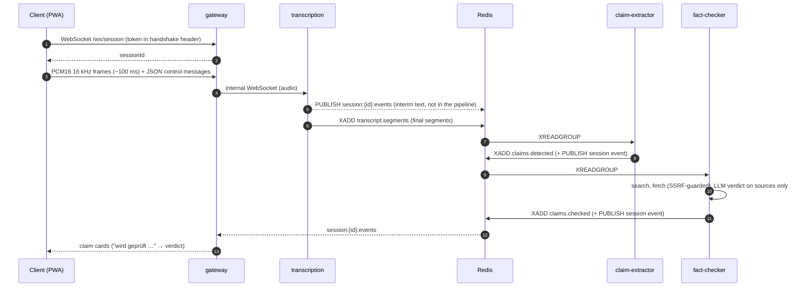
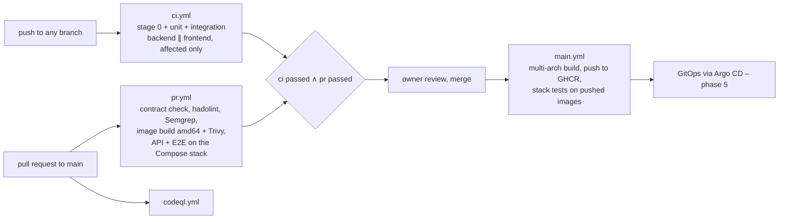

# Architecture

This document describes how live-factcheck is put together. The requirements are in [PROJECT_BRIEF.md](PROJECT_BRIEF.md) (German); individual decisions are in [adr/](adr/). Parts marked *planned* do not exist yet.

## Principles

- **One service per responsibility, one container per service.** Each builds, starts and scales on its own.
- **Stateless services.** State lives in Redis (streams, cache, session state) and later Postgres, so any instance can be replaced at any time.
- **Event-driven pipeline** on Redis Streams with consumer groups; workers scale horizontally and process idempotently (at-least-once delivery, `XACK` after success, `XAUTOCLAIM` for stuck messages).
- **Twelve-factor**: config only via environment and secret files, validated at startup; logs as JSON on stdout; graceful shutdown on SIGTERM.
- **Adapters for every external dependency** (LLM, speech-to-text, search), chosen by configuration, including local models and deterministic mocks for tests.
- **Contract-first**: every event and API payload is a versioned zod schema in `packages/contracts`.

## Components

| Component | Tech | Responsibility | Scaling | State |
|---|---|---|---|---|
| `web` | React, Vite, Tailwind, Zustand; nginx | PWA frontend; runtime config via `/config.json` | any (static) | skeleton |
| `gateway` | Node.js, Fastify | only public API: REST + WebSocket, sessions, audio forwarding, event push | horizontal (WebSocket fan-out via Pub/Sub) | skeleton |
| `transcription` | Node.js | streaming speech-to-text via adapters or `stt-local` | by active sessions | skeleton |
| `stt-local` | Python, FastAPI, faster-whisper | fully local transcription (optional profile) | CPU/GPU bound | planned (phase 2) |
| `claim-extractor` | Node.js worker | rolling window per session, claim extraction via LLM, deduplication | consumer group | skeleton |
| `fact-checker` | Node.js worker | search, fetch, LLM verdict on the fetched sources only | consumer group; most expensive | skeleton |
| `redis` | Redis 8 | streams, Pub/Sub, cache (ACL users `app`, read-only `mcp`) | – | running (Compose) |
| `searxng` | SearXNG | self-hosted meta search without API key | – | running (Compose) |
| `caddy` | Caddy | TLS termination, security headers; later the Ingress | – | running (Compose) |
| `postgres` | PostgreSQL | session history, claims, verdicts | – | planned (phase 4) |

Shared packages: `@lfc/contracts` (schemas), `@lfc/service-kit` (config, logging, ops endpoints, Redis, lifecycle), `@lfc/providers` (adapters; LLM config in phase 0).

## Data flow



Text mode (phase 1): `POST /api/claims/check` writes a typed claim straight to `claims.detected`.

## Contracts

| Schema | Where | Key fields |
|---|---|---|
| `TranscriptSegment` | `transcript.segments` | sessionId, segmentId, speaker, text, startMs, endMs, isFinal, language |
| `ClaimDetected` | `claims.detected` | claimId, speaker, text, normalizedText, sourceSegmentIds, detectedAt |
| `ClaimChecked` | `claims.checked` | verdict (`stimmt` … `nicht_pruefbar`), confidence, explanation (≤ 2 sentences), sources, provider |
| `EventEnvelope` | all streams and the session channel | `{ type, schemaVersion, payload }` |

Formats and rules: [ADR 0002](adr/0002-event-contract-format.md). The verdict is a category plus confidence and sources, never a percentage, because LLM percentages are not calibrated.

## Service anatomy

Every Node service has the same shape, copied from the reference service `gateway` (skill `new-service`):

```
services/<name>/
├─ src/config.ts        zod schema = baseConfigSchema + service fields; secretKeys
├─ src/main.ts          runService({ name, configSchema, secretKeys, start })
├─ src/*.test.ts        unit tests (real child process)
├─ src/*.int.test.ts    integration tests (Testcontainers)
├─ Dockerfile           base → deps → dev | build → runtime (distroless, uid 65532)
└─ AGENTS.md            rules for this service
```

`runService` from `@lfc/service-kit` validates config (exit 1 with the names of missing variables, never values), creates the JSON logger with secret redaction, serves `/healthz`, `/readyz` (per-dependency checks, 503 while shutting down) and `/metrics` (Prometheus), and shuts down within `SHUTDOWN_TIMEOUT_MS` on SIGTERM.

## Runtime environments

| Stage | Where | How | State |
|---|---|---|---|
| Local | Docker Compose on macOS (Apple Silicon) | `make up`; networks `edge` / `internal` / `egress`; only Caddy publishes ports; Compose secrets from a directory outside the repo ([ADR 0004](adr/0004-compose-network-topology.md)) | running |
| Local cluster | k3d (1 server, 2 agents) | Kustomize base + overlays, Argo CD, KEDA on stream lag, NetworkPolicies, Pod Security `restricted` | planned (phase 5) |
| Real cluster | k3s on VMs via Terraform | staging and prod, cert-manager, backups, signed images with SBOM | planned (phase 6) |

The same image runs in every environment; only configuration differs (factor V).

## CI/CD



A nightly workflow adds mutation testing, Lighthouse, Firefox and a full image scan. Layout and de-duplication of push and PR runs: [ADR 0005](adr/0005-ci-workflow-layout.md).

## Security architecture (summary)

- Secrets only as files or env, never in git, images, the frontend bundle, `/config.json` or logs. Each service gets only the secrets it needs.
- Hardened containers: non-root, read-only root filesystem, `cap_drop: [ALL]`, `no-new-privileges`, resource limits.
- Network segmentation: only Caddy is reachable from the host; Redis and SearXNG are internal.
- From phase 1: gateway token in headers only, SSRF guard for every fetched URL, fetched pages treated as data (prompt injection), LLM output validated against the schema.

Threat model, secret handling, key rotation and the leak procedure: [SECURITY.md](SECURITY.md).
