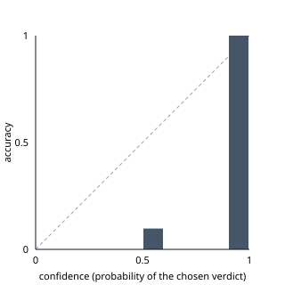

# Eval report: mock-dry-run

- Run: 2026-09-27T09:25:20.328Z
- Dataset: `evals/claims.de.jsonl`, 46 claims **including labels not yet reviewed by the owner (not a valid result, brief 13.5)**
- Providers: fact-checker/llm: mock mock, fact-checker/classifier: mock, fact-checker/embeddings: mock mock, fact-checker/search: mock, explainer/llm: mock mock

## Result

| Metric | Value |
|---|---|
| Answered / timeouts | 46 / 0 |
| Accuracy (exact verdict) | 13.0 % |
| Direction accuracy (wahr / falsch / offen) | 15.2 % |
| Coverage (checkable claims with a real verdict) | 9.8 % |
| Brier score (0 perfect, 2 worst) | 0.924 |
| Expected calibration error | 0.405 |
| Cost per claim / total | $0.0000 / $0.0000 |
| nicht_pruefbar reasons | classified_unverifiable: 42 |

## Accuracy by confidence level

| Level | Claims | Accuracy |
|---|---|---|
| hoch | 2 | 100.0 % |
| mittel | 3 | 0.0 % |
| niedrig | 41 | 9.8 % |

## Accuracy by category

| Category | Claims | Accuracy |
|---|---|---|
| datum | 10 | 10.0 % |
| ereignis | 2 | 0.0 % |
| meinung | 3 | 100.0 % |
| ort | 5 | 0.0 % |
| person | 4 | 0.0 % |
| prognose | 2 | 100.0 % |
| wissenschaft | 5 | 0.0 % |
| zahl | 15 | 0.0 % |

## Latency per path (brief 9.6)

| Path | Claims | Pipeline p50 | Pipeline p95 | Client p50 | Client p95 |
|---|---|---|---|---|---|
| none | 46 | 0 ms | 1 ms | 4 ms | 14 ms |
